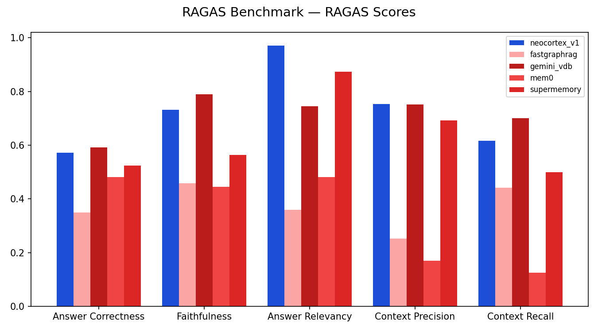
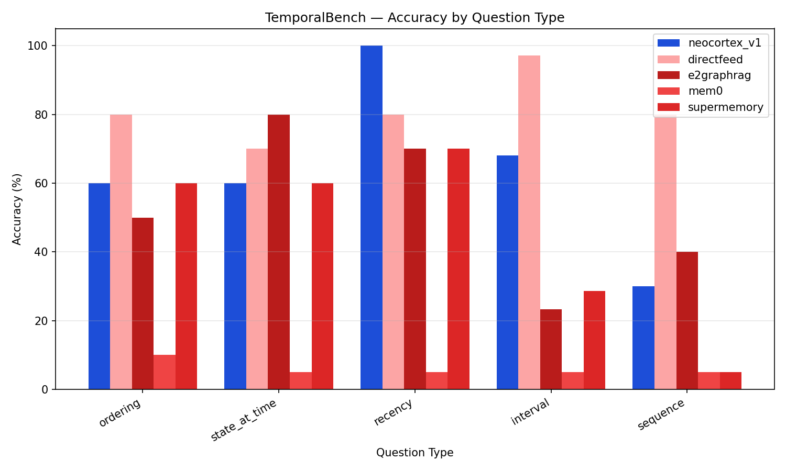
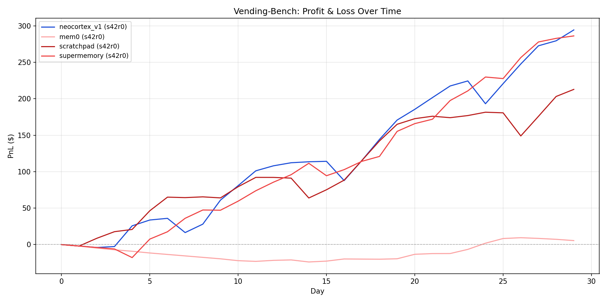

<div align="center">
<br/>

<h1>Neocortex AI Memory</h1>

<h3>Your Second Brain</h3>

<p><b>Human-like AI Memory&nbsp; ◦ &nbsp;1B+ Token Processing&nbsp; ◦ &nbsp;Forgets Noise&nbsp; ◦ &nbsp;Interaction-Aware</b></p>

<h4>
  <a href="#-benchmarks">Benchmarks</a>&nbsp; • &nbsp;
  <a href="#-getting-started">Getting Started</a>&nbsp; • &nbsp;
  <a href="BENCHMARKS.md">Full Results</a>&nbsp;
</h4>

</div>

---

# 🧠 Introduction to Neocortex

The human brain is a master of compression. It doesn't try to remember every passing detail; instead, it aggressively prunes noise to maintain a sharp, focused, and easily accessible recall of what truly matters. In contrast, traditional AI memory systems try to remember everything. They retrieve whatever is _similar_—but similar doesn't mean important. The result? Your AI drowns in stale, irrelevant context that degrades every response.

Inspired by how the human brain actually works, **Neocortex** takes a different approach: it **intelligently forgets noise**. Just like you don't remember every sentence you've ever read or everything happens every day in your life, Neocortex lets low-value memories naturally decay while reinforcing the knowledge that matters — the things you interact with, recall, and build upon.

The result: an AI memory system that can chop through over 1 billion tokens, stays lean and focused, and gets smarter with every interaction.

### 🎯 Core Features

- **Intelligent Noise Filters**: Memories that aren't accessed naturally decay over time. Frequently recalled knowledge becomes more durable. No manual cleanup needed — the system stays lean on its own.

- **Interaction-Aware**: Not all memories are equal. Views, reactions, replies, and content creation all signal what matters. Knowledge people engage with rises to the top; ignored information fades away.

- **Low Latency, Low Cost, High Quality**: There's no compromise on speed and quality when processing data with Neocortex. Everything is processed at low costs and low latency, while maintain high benchmarks.

---

# 📈 Benchmarks

Neocortex is evaluated across four benchmark suites. See [BENCHMARKS.md](BENCHMARKS.md) for full methodology and results.

### RAGAS — Retrieval Quality (Sherlock Holmes Corpus)

Standard RAG quality metrics evaluated using [RAGAS](https://docs.ragas.io/). Neocortex leads in **Answer Relevancy (0.97)** and **Context Precision (0.75)**, outperforming FastGraphRAG, Gemini VDB, Mem0, and SuperMemory.

<div align="center">

</div>

### TemporalBench — Temporal Reasoning

Accuracy across ordering, state-at-time, recency, interval, and sequence questions. Neocortex achieves **100% on recency questions** — correctly surfacing the most recent events thanks to its time-decay memory model.

<div align="center">

</div>

### BABILong — Needle in a Haystack

Can the system find specific facts buried in large contexts? Neocortex is the **only method to successfully retrieve needles at 4k context length**, while directfeed (raw context window) scores 0% across all lengths.

<div align="center">

</div>

### Vending-Bench — Agentic Decision-Making

An agent manages a simulated vending machine business over 30 days. Neocortex achieves the **highest cumulative P&L (~$295 by day 30)** — better memory leads to better decisions over time.

<div align="center">

</div>

---

# ⚡ Getting Started

### 1. Install

```bash
pip install neocortex
```

### 2. Configure

```python
from neocortex import Neocortex

nc = Neocortex(
    api_key="your-api-key",
    model="mk1",
)
```

### 3. Ingest & Query

```python
# Add documents
await nc.insert("Sherlock Holmes lived at 221B Baker Street...")

# Query with human-like memory retrieval
result = await nc.query("Where did Sherlock Holmes live?")
print(result.answer)
```

---

# 💰 Pricing

Pricing is per 1M tokens (USD).

| Model ID | Base URL                    | Input             | Output            |
| -------- | --------------------------- | ----------------- | ----------------- |
| `mk1`    | `https://api.tinyhuman.xyz` | $2.00 / 1M tokens | $6.00 / 1M tokens |

OpenAI-compatible API. See [API.md](API.md) for full endpoint documentation.

---

<div align="center">

Built by [bnbpad.ai](https://bnbpad.ai)

</div>
