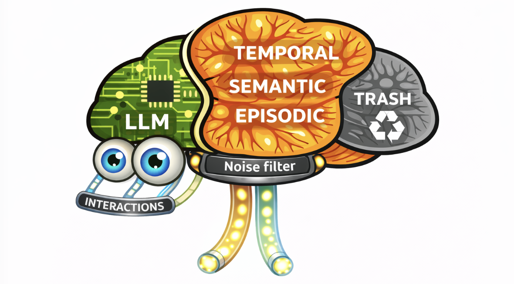
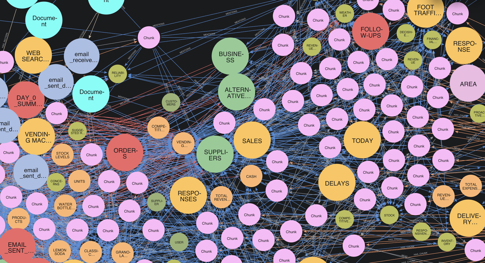

<div align="center">

<h1>Neocortex AI Memory 🧠 - Your Second Brain</h1>

**Human-like AI Memory  ◦  10Mn+ Token Processing  ◦  Upto 4000 tok/s  ◦  0.1$/Mn tokens**

[Discord](https://discord.com/invite/k23Kn8nK)
[Reddit](https://www.reddit.com/r/tinyhumansai/)
[X](https://x.com/tinyhumansai)
[Docs](https://tinyhumans.gitbook.io/neocortex/)

#### [Benchmarks](./benchmarks/README.md)  •   [Getting Started](#-getting-started)  •   [Documentation](https://tinyhumans.gitbook.io/neocortex/)  •   [Get your API key](https://tinyhumans.ai) 

_NOTE: That this model is currently in closed alpha. To get access [reach out to us](mailto:founders@tinyhumans.ai)_

</div>

The human brain is a master at compression. It doesn't try to remember every passing detail; instead, it aggressively prunes noise to maintain a sharp, focused, and easily accessible recall of what truly matters. In contrast, traditional AI memory systems try to remember everything. They retrieve whatever is _similar_—but similar doesn't mean important. The result? Your AI drowns in stale, irrelevant context that degrades every response.

Inspired by how the human brain works, **Neocortex** takes a similar approach to AI memory: it **intelligently forgets noise**. Just like how you don't remember every sentence you've ever read or everything happens every day in your life, Neocortex lets low-value memories naturally decay while reinforcing the knowledge that matters — the things you interact with, recall, and build upon.

The result? an AI memory system that can chop through over 10 million tokens accurately at speeds of upto 4000 tokens/second, stays lean and focused, and gets smarter with every interaction.

Neocortex ranks extremely high scores on [RAGAS](https://www.ragas.io/), [Babilong](https://github.com/booydar/babilong/), [Vending Bench](https://andonlabs.com/evals/vending-bench-2), [LoCoMo](https://github.com/snap-research/locomo) and [HotPotQA](https://hotpotqa.github.io/)



# 🎯 Core Features

## Intelligent Noise Filters

Memories that aren't accessed naturally decay over time. Frequently recalled knowledge becomes more durable. No manual cleanup needed — the system stays lean on its own.

## Interaction-Aware

Not all memories are equal. Views, reactions, replies, and content creation all signal what matters. Knowledge people engage with rises to the top; ignored information fades away.

## Low Latency, Low Cost, High Quality

There's no compromise on speed and quality when processing data with Neocortex. Everything is processed at low costs and low latency, while maintain high benchmarks.

# 📈 Benchmarks

### RAGAS — Retrieval Quality (Sherlock Holmes Corpus)

Standard RAG quality metrics evaluated using [RAGAS](https://docs.ragas.io/). Neocortex leads in **Answer Relevancy (0.97)** and **Context Precision (0.75)**, outperforming FastGraphRAG, Gemini VDB, Mem0, and SuperMemory.


### TemporalBench — Temporal Reasoning

Accuracy across ordering, state-at-time, recency, interval, and sequence questions. Neocortex achieves **100% on recency questions** — correctly surfacing the most recent events thanks to its time-decay memory model.


### Vending-Bench — Agentic Decision-Making

An agent manages a simulated vending machine business over 30 days. Neocortex achieves the **highest cumulative P&L (~$295 by day 30)** — better memory leads to better decisions over time.


---

# ⚡ Getting Started

Neocortex ships with SDKs for [Python](./packages/sdk-python), [TypeScript/JavaScript](./packages/sdk-typescript), [Go](./packages/sdk-golang), [Rust](./packages/sdk-rust), [Dart](./packages/sdk-dart), [C++](./packages/sdk-cpp), [C#](./packages/sdk-csharp), and [Java](./packages/sdk-java), plus plugins for [LangGraph](./packages/plugin-langgraph), [OpenClaw](./packages/plugin-openclaw), [ElevenLabs](./packages/plugin-elevenlabs), [CrewAI](./packages/plugin-crewai), [Raycast](./packages/plugin-raycast), [Agno](./packages/plugin-agno) [Pipecat](./packages/plugin-pipecat), [Mastra](./packages/plugin-mastra), [Autogen](./packages/plugin-autogen) and more.

See `[packages/README.md](./packages/README.md)` for details about all the SDKs/Plugins available to use along with documentation and examples.

Below is a simple quickstart example on getting started with Python.

### 1. Install

```bash
pip install tinyhumansai
```

### 2. Configure and Run

```python
import tinyhumansai as api

client = api.TinyHumanMemoryClient("YOUR_APIKEY_HERE")

# Store a single memory
client.ingest_memory({
    "key": "user-preference-theme",
    "content": "User prefers dark mode",
    "namespace": "preferences",
    "metadata": {"source": "onboarding"},
})

# Ask a LLM something from the memory
response = client.recall_with_llm(
    prompt="What is the user's preference for theme?",
    api_key="OPENAI_API_KEY"
)
print(response.text) # The user prefers dark mode
```

# Star us on Github

_Like contributing towards AGI 🧠? Give this repo a star and spread the love ❤️_

[](https://www.star-history.com/?repos=tinyhumansai%2Fneocortex&type=date&legend=top-left)
