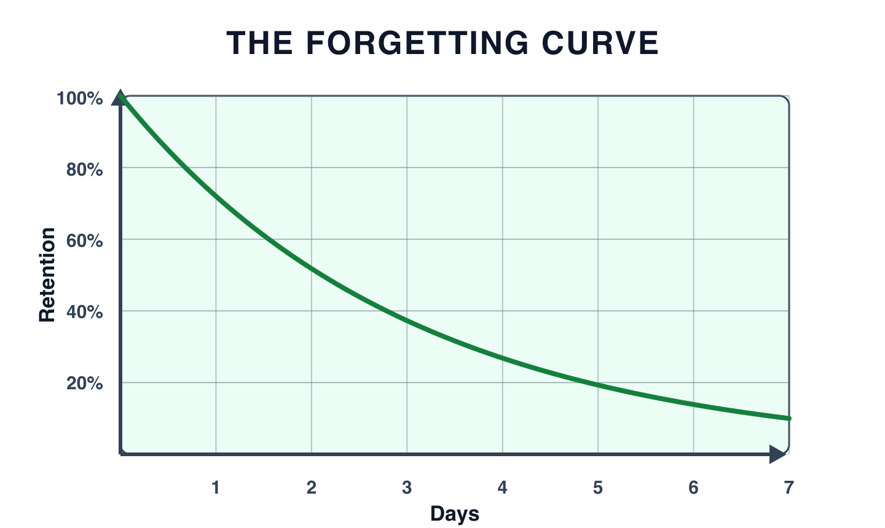
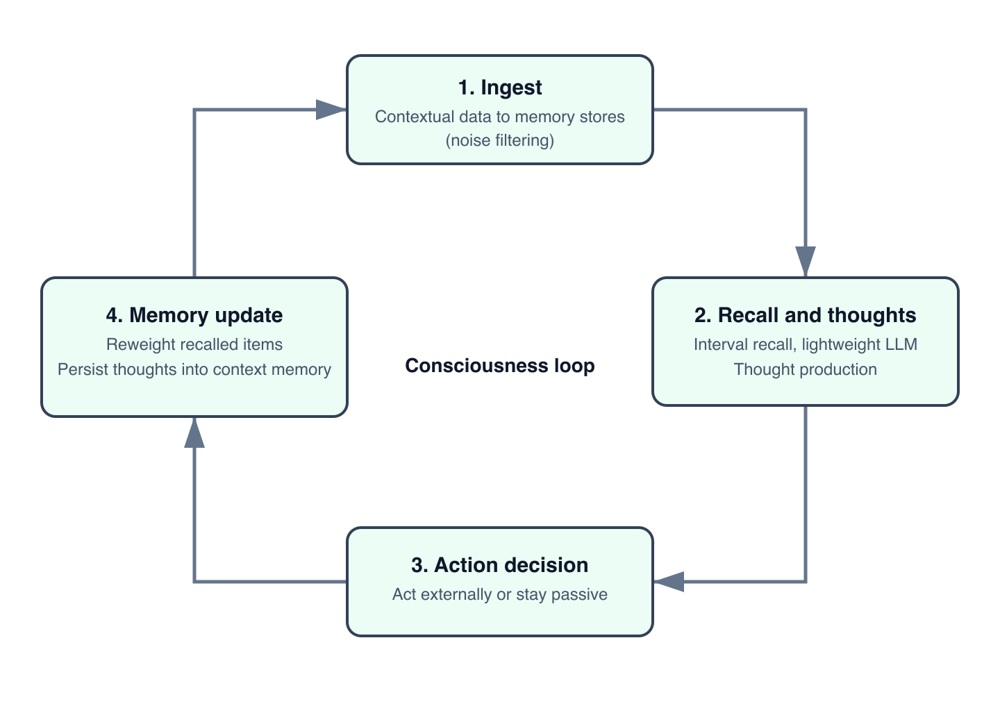
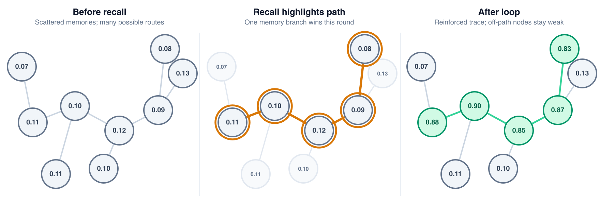
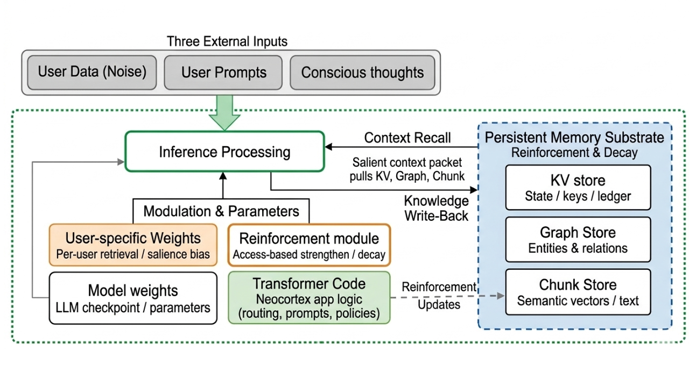

# Neocortex (Draft)

Building Artificial Consciousness with a High-Throughput Context System

### Authors

- <a href="mailto:enamakel@tinyhumans.ai">Steven Enamakel (Tiny Humans)</a>

### Table of contents

- [Abstract](#abstract)
- [Introduction](#introduction)
- [Related Work](#related-work)
  - [Titans and MIRAS: Long-Term Memory for Language Models](#titans-and-miras-long-term-memory-for-language-models)
  - [GraphRAG and Graph-Based Memory and Retrieval](#graphrag-and-graph-based-memory-and-retrieval)
  - [MemoryBank: Retention-Aware Memory for Language Models](#memorybank-retention-aware-memory-for-language-models)
- [Understanding the Human Brain](#understanding-the-human-brain)
  - [Purkinje Cells](#purkinje-cells)
  - [Ebbinghaus Forgetting Curve](#ebbinghaus-forgetting-curve)
  - [Conscious and Subconscious Processing](#conscious-and-subconscious-processing)
- [Consciousness Loop](#consciousness-loop)
  - [Phase 1: Large-Scale Contextual Ingestion](#phase-1-large-scale-contextual-ingestion)
  - [Phase 2: Interval-Based Recall and Thought Synthesis](#phase-2-interval-based-recall-and-thought-synthesis)
  - [Phase 3: Action Decision](#phase-3-action-decision)
  - [Phase 4: Memory Update and Thought Persistence](#phase-4-memory-update-and-thought-persistence)
  - [Why This Loop Matters](#why-this-loop-matters)
- [Implementation & Results](#implementation-results)
  - [Current Evaluation Status](#current-evaluation-status)
  - [Observed Behavior](#observed-behavior)
  - [Limitations and Next Measurement Steps](#limitations-and-next-measurement-steps)
- [Conclusion](#conclusion)

# Abstract

Large Language Models already perform well; Retrieval-Augmented Generation (RAG) improves them further via external grounding. Neither is conscious or instinct-like: behavior stays *reactive* and *task-framed*, while retrieved context is easily **polluted** and systems stay **narrow** relative to open-ended, long-horizon coherence. They excel at explicit logical reasoning yet still fail at **sustained, open-world judgment** when evidence is partial and goals are implicit or shifting.

present **Neocortex**, a multi-store memory architecture for inference-time adaptation: semantic and graph retrieval, an ordered state-event ledger, retention-aware forgetting, and interval-based thought synthesis. It implements an artificial consciousness loop—what to reinforce, forget, and promote to durable state—under strict latency and token budgets. Memory is substrate for continuity, not the end goal.

**Key observations.** In practice the loop supports *real-time* thought generation and streaming speech while recall and memory updates run concurrently; in representative sessions, a coherent user-specific model of context, preferences, and narrative can emerge within minutes—not after a long cold start—as a concrete step toward mapping a user’s consciousness at interaction scale.

# Introduction

Modern LLMs can reason impressively within a single prompt, but building long-horizon systems remains hard. Despite steady progress in reasoning, LLMs are still constrained by finite context windows and weak persistence across interactions. Reasoning-oriented LLMs can allocate more computation to multi-step deliberation, yet they remain highly sensitive to what is placed into context, and naive RAG retrieval often treats memory as a flat collection of text chunks. Simply scaling context windows is expensive: attention and KV-cache costs grow rapidly with sequence length, and longer prompts can reduce accuracy by injecting irrelevant material, diluting key evidence, and increasing the chance that the model attends to the wrong details. Practical long-horizon systems therefore need memory mechanisms that select, structure, and refresh context rather than simply making the window bigger.

In parallel, a growing ecosystem of memory tooling has emerged that is already highly efficient at storing and retrieving information for LLM applications. Systems such as MemGPT, mem0, and Supermemory maintain external memory stores and retrieval policies that can prioritize memories by time/recency, entities and user profiles, interaction history, or task-specific reasoning needs. These approaches demonstrate that the core bottleneck is often not storage, but selecting the right facts at the right time under tight latency and token budgets.

The human brain faces an extreme noise problem: it continuously receives high-volume, ambiguous, and often redundant signals, yet it filters and compresses them into a small set of salient memories that influence future behavior. Many current LLM memory systems can store and retrieve efficiently, but they struggle to consistently infer and surface *importance*—what should be reinforced, what should be forgotten, and what should be promoted to durable state—especially when signals are subtle, long-range, or conflicting. Human memory offers a useful conceptual alternative: it is reinforced through use, decays over time, and is selectively updated when new experiences are surprising or contradictory, motivating forgetting-aware updates, episodic segmentation, graph-based retrieval, and persistent memory modules.

Viewed against this biological backdrop, current LLM systems often remain non-human-like in memory behavior for three interrelated reasons. First, they frequently lack strong **selective gating**, so too much irrelevant context enters the active reasoning path. Second, they lack robust **adaptive forgetting**, so memory either accumulates noise or loses important details without principled reinforcement. Third, they typically lack an **always-on subconscious loop** that continuously consolidates, reweights, and organizes experience between explicit tasks. Any path toward more human-like memory therefore requires all three: integration with gating, retention with controlled decay, and background consolidation over time.

This paper introduces **Neocortex**, a product-level architecture for artificial consciousness that uses adaptive memory as its substrate. Figure <a href="#fig:consciousness-architecture" data-reference-type="ref" data-reference="fig:consciousness-architecture">5</a> summarizes the inference stack and external inputs at a high level. It unifies these strands into a single operational pipeline. Neocortex continuously ingests new experience into structured memory and recalls context through a blend of semantic relevance, recency, interaction history, and surprise-weighted salience. At write time, the system parses documents into chunks, extracts entities and relations, persists them in graph/vector memory, and appends explicit state transitions to an event ledger. At recall time, the system routes queries either to broad semantic retrieval or to a deterministic state resolver when the question targets ordered state transitions. Memory is further modulated by reinforcement through access patterns and by Ebbinghaus-style forgetting dynamics.

Our main claim is that artificial consciousness requires a **multi-store adaptive memory substrate** rather than a passive retrieval index. In particular, efficient token use requires not only better retrieval, but also mechanisms for forgetting noise, amplifying informative novelty, and separating semantic context from ordered state so that stable internal state can emerge across time.

The rest of this paper follows a simple progression: related work, biological design motivation, the Neocortex control loop, and results.

# Related Work

## Titans and MIRAS: Long-Term Memory for Language Models

Google’s Titans line of work reframes the role of memory in sequence models by separating fast in-context processing from a slower persistent memory path (Behrouz, Zhong, et al. 2025). Instead of relying only on larger context windows, Titans introduces a learned long-term memory mechanism that can carry information across longer horizons and complement attention.

The follow-on MIRAS perspective extends this idea by viewing sequence models as associative memory systems with explicit retention and biasing dynamics (Behrouz, Razaviyayn, et al. 2025). In this framing, retrieval and retention are not side effects of attention alone; they are first-class mechanisms that can be shaped during inference.

As of this writing, these architectures are still largely in the research stage and have not yet been seen in production.

## GraphRAG and Graph-Based Memory and Retrieval

GraphRAG demonstrates that graph structure can improve retrieval beyond flat vector similarity. GraphRAG builds entity-centric knowledge graphs and supports more global, query-focused reasoning over corpora (Edge et al. 2024; Microsoft Research 2025).

A common limitation in graph-centric systems is ingestion cost and latency at very large scale. Building and maintaining high-quality graphs often requires substantial LLM use during extraction and linking, which can make indexing pipelines slow and expensive on massive datasets.

## MemoryBank: Retention-Aware Memory for Language Models

MemoryBank (Zhong et al. 2023) is one of the most direct precursors to retention-aware memory in LLM systems. It introduces a long-term memory module that explicitly models memory strength over time and updates retention based on interaction, rather than treating memory as static retrieved text.

# Understanding the Human Brain

Before proposing implementation details, we briefly ground the design in biological memory principles. The goal is not to claim a complete neural equivalence, but to extract practical mechanisms for integration, selection, and retention that can improve long-horizon AI behavior.

## Purkinje Cells

*The “we problem”* in artificial consciousness can be framed as a coordination problem: how separate signals become a coherent self-model that acts as a unified agent. In biological systems, this coherence is not produced by a single neuron, but by layered circuits that compress, filter, and synchronize information across time.

Purkinje cells provide a useful computational analogy for how *background activity* can coexist with *coordinated control*. As the principal output neurons of the cerebellar cortex, they integrate massive parallel input; critically, they also exhibit **ongoing, partly stochastic simple-spike firing**—high-rate baseline activity and intermittent modulation that does not reduce to “one external stimulus, one discrete output.” That endogenous drive is part of why the cerebellum supports fine timing and internally generated adjustments, not purely reactive, step-by-step responses.

For systems that treat ambient *noise* and *conscious thoughts* as first-class inputs (Figure <a href="#fig:consciousness-architecture" data-reference-type="ref" data-reference="fig:consciousness-architecture">5</a>), the lesson is not only integration and gating, but **permission for spontaneous initiation**: ongoing, intermittently triggered internal activity can surface as endogenous thoughts or micro-actions, which are then amplified or suppressed by learned feedback. Three design principles carry over: **(i)** high-dimensional input integration, **(ii)** time-varying, partly stochastic output that can qualify or initiate behavior without a single explicit user prompt, and **(iii)** selective inhibitory gating and calibration through interaction (see Figure <a href="#fig:purkinje-cell-diagram" data-reference-type="ref" data-reference="fig:purkinje-cell-diagram">1</a>).

<figure id="fig:purkinje-cell-diagram" data-latex-placement="H">

<figcaption>Purkinje cells as biological reference: parallel integration, ongoing spontaneous firing, and inhibitory gating of downstream pathways.</figcaption>
</figure>

This motivates a memory controller that does more than retrieve nearest neighbors. A robust system should aggregate semantic, episodic, and temporal evidence, then gate what enters active context—including candidates surfaced by *internally generated* activity, not only by user-issued prompts. In other words, conscious-like behavior is approached not by storing everything, but by learning which memories (and which spontaneous internal candidates) should influence the current decision boundary.

## Ebbinghaus Forgetting Curve

As a conceptual foundation, the Ebbinghaus forgetting curve describes how memory retention declines over time when information is not reinforced. This idea is well documented and widely referenced in cognitive science and later replication studies (Lewandowsky et al. 2015). For memory systems, the implication is practical: high-value information should be rehearsed or reused, while low-value details should naturally decay.

<figure id="fig:forgetting-curve" data-latex-placement="H">

<figcaption>Ebbinghaus-inspired forgetting dynamics: retention drops rapidly without reinforcement, motivating selective memory maintenance.</figcaption>
</figure>

This leads to an implementation strategy before tackling stronger claims about artificial consciousness: encode candidate memories at write time, then modulate retention as a function of access frequency, recency, and utility. With retention-aware scoring and periodic pruning, stale or weakly supported memories lose influence while salient patterns remain available for recall.

## Conscious and Subconscious Processing

Another useful cognitive distinction is between conscious and subconscious processing. The conscious layer is task-facing and deliberative: it responds to explicit goals, prompts, and immediate decisions. The subconscious layer is background and continuous: it keeps running even when no explicit query is present, consolidating experience, updating associations, and reweighting salience.

In human cognition, much of memory organization happens in this always-on background mode rather than only during active reasoning. For memory systems, this suggests that high-quality recall depends not only on query-time retrieval, but also on continuous offline maintenance: reinforcement of recurring signals, decay of stale noise, and periodic synthesis of latent patterns that may become relevant later.

# Consciousness Loop

After the biological motivation, we now describe the core operational mechanism: a recurring control loop that continuously updates memory and policy state.

In production, sources arrive first as **noise**: high-volume, redundant, and weakly structured streams that are not yet safe to recall verbatim. **Ingest** (phase 1) digests that firehose—filtering, deduplicating, and normalizing—so only curated context lands in memory stores for later phases. The loop then runs in **four phases**: **(1)** ingest, **(2)** interval-based recall and thought synthesis, **(3)** action decision, and **(4)** memory updates. The system accumulates rich context about a user or entity over long horizons, then transforms that context into compact internal thoughts that persist and compete for recall in later cycles.

<figure id="fig:consciousness-loop" data-latex-placement="H">

<figcaption>Control loop: raw <em>noise</em> feeds ingest, which filters and structures data for recall and thought synthesis; action may emit side effects into the <em>real world</em> (email, APIs, UI), while memory reweighting feeds back into recall—not into ingest or the raw-noise path.</figcaption>
</figure>

## Phase 1: Large-Scale Contextual Ingestion

The first phase sits immediately downstream of noisy raw input: it continuously ingests heterogeneous signals that describe the entity’s world state and behavior. In practice, this includes email threads, direct messages, documents, notes, tickets, logs, and other structured or semi-structured artifacts that can provide identity, intent, preference, and temporal context.

At write time, raw inputs are normalized, segmented into chunks, and mapped into memory stores (semantic vectors, entity/relation graphs, and state-transition events). This allows later recall to query the same underlying history from multiple perspectives: “what is relevant,” “who and what are connected,” and “what changed over time.” Critically, this phase is not a pure accumulation step: the system also applies early noise-forgetting heuristics so low-signal, repetitive, or non-actionable fragments do not dominate long-term memory.

## Phase 2: Interval-Based Recall and Thought Synthesis

The second phase runs at regular intervals, independent of user prompts. During each cycle, the system recalls a small, high-salience memory set using recency, relevance, interaction frequency, and surprise-weighted signals. Rather than sending the full memory graph to a heavy model, the system passes this compact recall packet to a lightweight LLM prompt.

The objective of this prompt is not long-form generation but **thought production**: concise latent-state updates such as “new preference inferred,” “contradiction detected,” “follow-up risk,” or “candidate next action.”

## Phase 3: Action Decision

The third phase evaluates whether the system should **take external action** or remain passive. Given the recalled context and the synthesized thoughts, a policy decides if an outbound step is warranted—for example sending a follow-up, surfacing a reminder, updating an external system, or deferring until more evidence accumulates. When no action meets confidence or priority thresholds, the loop continues with internal updates only.

## Phase 4: Memory Update and Thought Persistence

The fourth phase closes the cycle by **reweighting** every memory item that participated in this recall round: items that proved useful gain reinforcement (stronger future recall), while items that contributed little or misled decay faster. Figure <a href="#fig:reinforcement-weights" data-reference-type="ref" data-reference="fig:reinforcement-weights">4</a> shows a concrete picture: a memory graph contains many low-weight links and alternate routes; recall highlights one *path* through that graph; after Phase 4 updates, weights along the activated trace jump so that trace is much less likely to be forgotten, while competing branches remain comparatively weak.

<figure id="fig:reinforcement-weights" data-latex-placement="H">

<figcaption>Reinforcement of weights in Phase 4 (toy subgraph): before recall, scattered weak branches; middle, recall selects one path; after reweighting, only that trace is strongly reinforced.</figcaption>
</figure>

The new thoughts from Phase 2 are **inserted into persistent context memory** as durable artifacts, so they can be retrieved in future cycles alongside raw ingested data. Together, reweighting and thought insertion implement subconscious consolidation: the internal model shifts before the next interval begins.

## Why This Loop Matters

This four-phase pattern—ingest, recall and think, decide on action, then update memory—separates expensive context accumulation from cheap continuous cognition. Periodic recall, lightweight prompting, and explicit write-back of thoughts and weights maintain an evolving internal model without a large model invocation at every interaction.

# Implementation & Results

We implement Neocortex as a custom memory architecture coupled with a lightweight LLM under the periodic consciousness loop described above. We then modify the inference layer of an open source LLM to allow it to use the Neocortex memory architecture.

<figure id="fig:consciousness-architecture" data-latex-placement="H">

 

</figure>

We do not use any LLMs for the ingestion and recall phases. We only use a lightweight LLM for the thought synthesis (consciousness loop) and action decision phases thereby allowing us to test with large amounts of context/data.

We then proceed to evaluate the performance of Neocortex on a bunch of benchmarks that test it’s ability to reason and make decisions whilst at the same time testing against a bunch of memory/retrieval benchmarks.

## Current Evaluation Status

This draft focuses on architecture and consciousness-loop behavior. At this stage, we do not claim full artificial consciousness or a final benchmark win over all baselines. Instead, we report the current validation framing and qualitative outcomes from internal usage.

## Observed Behavior

Across long-running interaction traces, Neocortex shows three consistent effects: **(1)** improved continuity across sessions due to persistent state-event handling, **(2)** lower context noise from retention-aware pruning, and **(3)** better handling of temporal/state questions through explicit ledger routing.

These behaviors are most visible on tasks that mix semantic recall with ordered state updates, where flat chunk retrieval frequently confuses what is relevant with what is current.

## Limitations and Next Measurement Steps

The current evidence is primarily qualitative and implementation-driven. Formal benchmarking (including ablations for routing, forgetting, and thought write-back) remains ongoing. The next version of this paper will add: **(i)** quantitative benchmark deltas, **(ii)** latency and token-cost breakdowns, and **(iii)** error analysis by query type.

# Conclusion

This paper argues that artificial consciousness is the target, and that long-horizon adaptive memory is a prerequisite layer rather than the final objective. Insights from Purkinje-style spontaneous activity and inhibitory gating, Ebbinghaus-style decay, and conscious versus subconscious processing suggest three requirements for more human-like behavior: selective integration, principled forgetting, and continuous background consolidation.

Related systems such as Titans/MIRAS, GraphRAG, and MemoryBank show important progress, but also surface practical gaps in production maturity, ingestion cost at scale, and retention-policy calibration. These constraints point to a broader design principle: memory quality depends as much on write-time filtering and maintenance loops as on query-time retrieval.

The practical takeaway is straightforward: ingest rich contextual data, forget noise aggressively, and continuously reinforce information that proves useful through interaction over time. These memory operations are the scaffolding for consciousness-like continuity: a system that can maintain a self-consistent evolving state, not just retrieve relevant text.

Behrouz, Ali, Meisam Razaviyayn, Peilin Zhong, and Vahab Mirrokni. 2025. “It’s All Connected: A Journey Through Test-Time Memorization, Attentional Bias, Retention, and Online Optimization.” *arXiv Preprint arXiv:2504.13173*.

Behrouz, Ali, Peilin Zhong, and Vahab Mirrokni. 2025. “Titans: Learning to Memorize at Test Time.” *arXiv Preprint arXiv:2501.00663*.

Clewett, Anne, and colleagues. 2024. “Predictions Transform Memories: How Expected Versus Unexpected Events Shape Memory.” *Neuroscience and Biobehavioral Reviews*.

Edge, Darren, Ha Trinh, Newman Cheng, et al. 2024. “From Local to Global: A Graph RAG Approach to Query-Focused Summarization.” *arXiv Preprint arXiv:2404.16130*.

Fountas, Zafeirios, Martin A. Benfeghoul, Adnan Oomerjee, et al. 2024. “Human-Like Episodic Memory for Infinite Context LLMs.” *arXiv Preprint arXiv:2407.09450*.

Jiménez Gutiérrez, Bernal, Yiheng Shu, Yu Gu, Michihiro Yasunaga, and Yu Su. 2024. “HippoRAG: Neurobiologically Inspired Long-Term Memory for Large Language Models.” *arXiv Preprint arXiv:2405.14831*.

Kim, and colleagues. 2024. “Prediction Error Determines How Memories Are Organized in the Brain.” *eLife*.

Lewandowsky, Stephan, Sergio E. Hartwig, and colleagues. 2015. “Replication and Analysis of Ebbinghaus’ Forgetting Curve.” *PLOS ONE*.

Microsoft Research. 2025. *GraphRAG Documentation*. <a href="https://microsoft.github.io/graphrag/" class="uri">Https://microsoft.github.io/graphrag/</a>.

Wu, Yaxiong, Xinyue Wang, Yue Zhang, et al. 2025. “From Human Memory to AI Memory: A Survey on Memory Mechanisms in the Era of LLMs.” *arXiv Preprint arXiv:2504.15965*.

Zhong, Wanjun, Lianghong Guo, Qiqi Gao, He Ye, and Yanlin Wang. 2023. “MemoryBank: Enhancing Large Language Models with Long-Term Memory.” *arXiv Preprint arXiv:2305.10250*.

